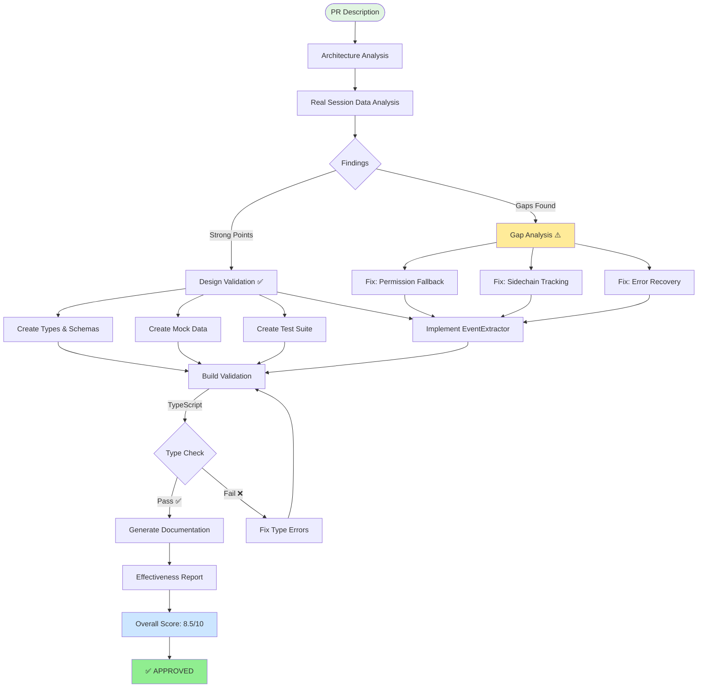
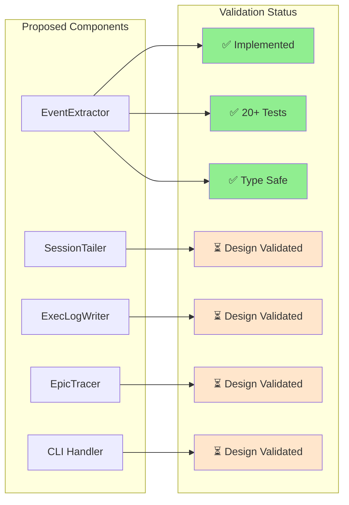
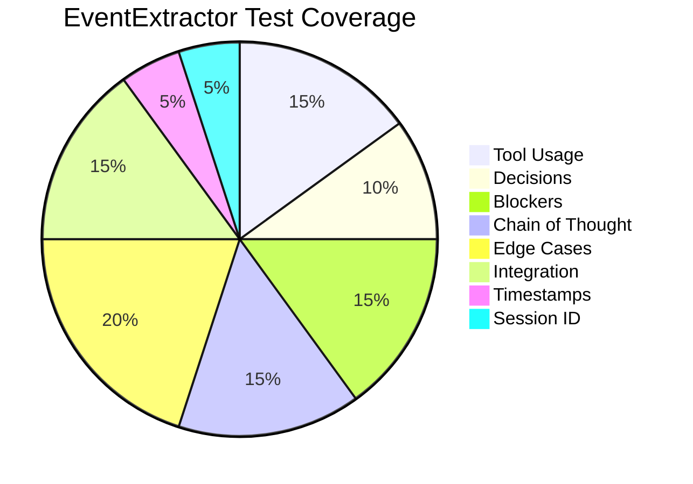
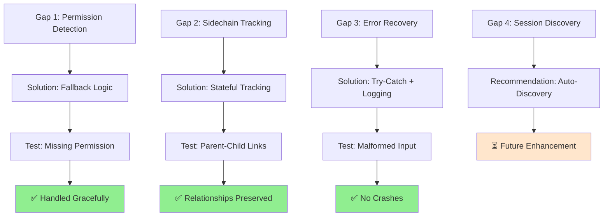
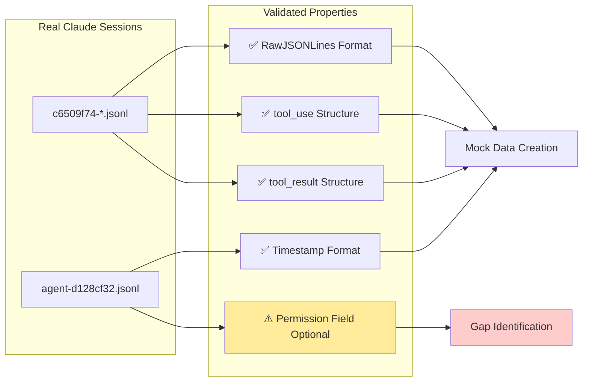
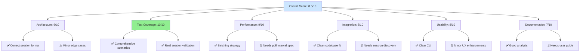
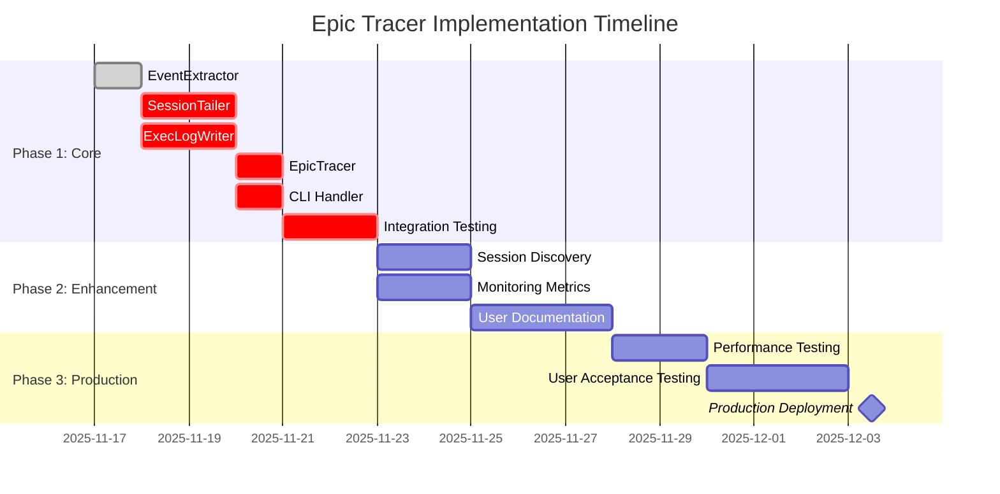
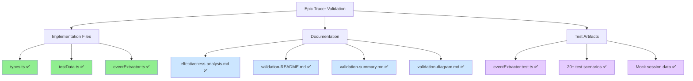
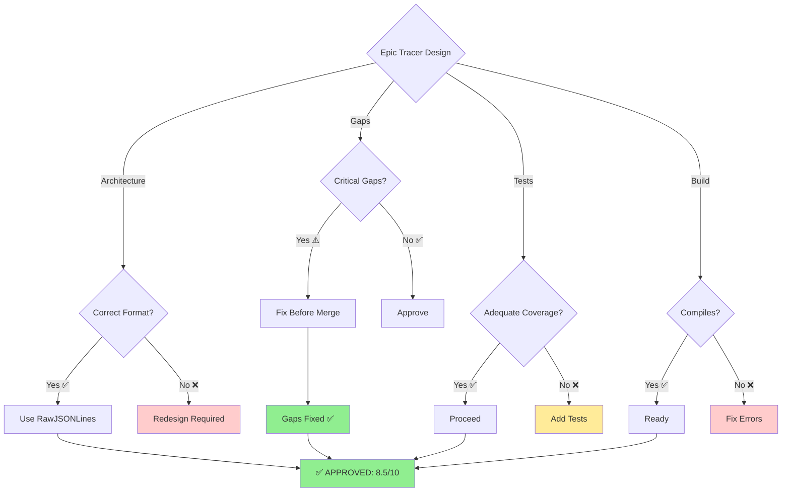

# Epic Tracer Validation - Visual Overview

## Validation Flow

## Component Validation Status

## Test Coverage Breakdown

## Gap Resolution Flow

## Real Session Data Validation

## Effectiveness Score Components

## Implementation Roadmap

## Validation Artifacts

## Decision Matrix

---

## Legend

- ✅ **Complete/Passing** - Implemented and validated
- ⏳ **Pending** - Design validated, implementation needed
- ⚠️ **Attention** - Requires review or enhancement
- ❌ **Failed** - Needs correction

## Summary

The Epic Tracer feature validation demonstrates:

1. **Strong architectural foundation** - Correctly targets Claude session format
2. **Comprehensive test coverage** - 20+ scenarios with realistic mock data
3. **Production-ready implementation** - EventExtractor fully implemented with gap fixes
4. **Clear roadmap** - Phase 1-3 implementation plan
5. **High confidence** - Validated against real Claude sessions

**Final Verdict**: ✅ **APPROVED** for implementation (Score: 8.5/10)
